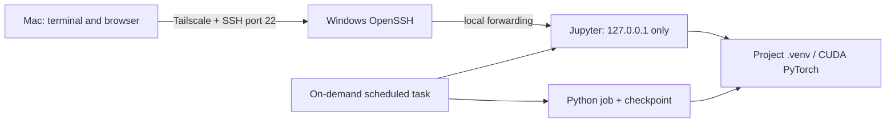

# Mac → Windows GPU

Use a Windows gaming PC as a remote Python GPU workstation from a Mac. Connect over Tailscale and OpenSSH, open Jupyter through an SSH tunnel, and run on-demand jobs independently of the terminal.

This is a practical native-Windows guide, with small reusable helpers. It grew out of a Windows 11 Home / RTX 4060 setup with limited RAM. It is not a research project, a model installer, or an unattended system configurator.

## Start here

1. [Assess the PC and choose storage](docs/planning.md).
2. [Configure unattended Tailscale and key-only OpenSSH](docs/remote-access.md).
3. [Create the isolated Python/CUDA environment](docs/environment.md).
4. [Run Jupyter and connect from the Mac](docs/jupyter.md).
5. [Run background jobs and test checkpoint recovery](docs/background-jobs.md).
6. [Work through the verification checklist](docs/verification.md).

For failures or removal, see [troubleshooting and rollback](docs/troubleshooting.md). The [reference results](docs/reference-results.md) distinguish historical observations from tests of these generalized helpers.

## Boundaries

- Windows boots normally; **no desktop auto-login** is needed for the intended setup. Firmware or BitLocker preboot prompts still need local help.
- SSH is limited to the intended Tailscale client. Jupyter listens only on loopback and keeps authentication enabled.
- Scheduled tasks use the current Windows user with limited privileges. They are on demand, with no boot triggers and no stored plaintext password.
- A dropped SSH connection and a reboot are different: scheduled jobs can continue through a disconnect; a reboot ends them. Restart from application checkpoints afterward.
- Nothing here downloads model weights or runs a scientific experiment. The examples are synthetic infrastructure tests.
- These are instructions to review and run incrementally, not a script to replace a working SSH or firewall configuration.

## Repository layout

| Path | Purpose |
| --- | --- |
| `docs/` | Setup, operation, verification, limitations |
| `environment/` | Minimal Python 3.12 project and universal uv lock |
| `scripts/` | Parameterized Jupyter and Windows task helpers |
| `examples/` | Tiny GPU, notebook, and checkpoint demonstrations |
| `tests/` | Standard-library tests; no GPU or system changes |

The runnable helpers expect a checkout outside OneDrive/iCloud/Dropbox. Private runtime files live in an ignored `.local/` directory with restricted Windows permissions. Never commit your operational reports, connection details, keys, tokens, or generated output.

## Status and reproducibility

The original workstation passed a tiny CUDA check and local task stop/resume tests. Its owner verified SSH over a hotspot, after sign-out, and after a cold boot without desktop login. Those observations **do not prove** that this checkout, every Windows configuration, or a Mac notebook session has been tested. Follow the [test matrix](docs/verification.md) on your own PC.

The environment lock makes dependency selection repeatable; it does not pin Windows, firmware, GPU drivers, Tailscale policy, or hardware. Capture those versions privately when validating a deployment. Review dependency updates deliberately rather than automatically accepting the newest resolver output.

Contributions should use synthetic examples and contain no machine-specific access information. See [CONTRIBUTING.md](CONTRIBUTING.md).
